## Part 1. Настройка gitlab-runner

* Поднимаем виртуальную машину *Ubuntu Server 20.04 LTS*

* Скачиваем и установливаем на виртуальную машину **gitlab-runner**

* Включаем и запускаем **gitlab-runner**

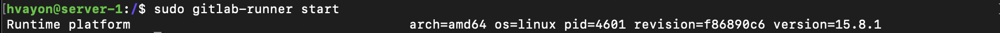

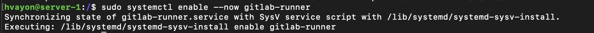

* Зарегистрируем его для использования в текущем проекте (DO6_CICD)

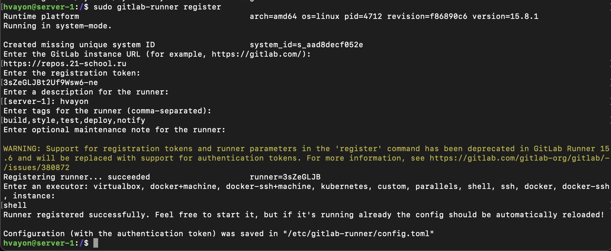

## Part 2. Сборка

**Написать этап для CI по сборке приложений из проекта *C2_SimpleBashUtils***
* В файле *gitlab-ci.yml* добавляем этап запуска сборки через Makefile из проекта C2
* Файлы, полученные после сборки (артефакты), сохраняем в произвольную директорию на 30 дней.

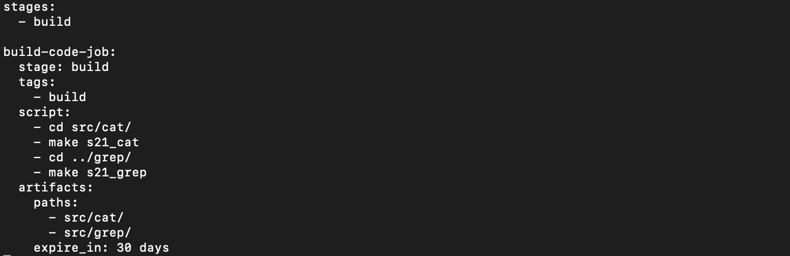

* Результат сборки:

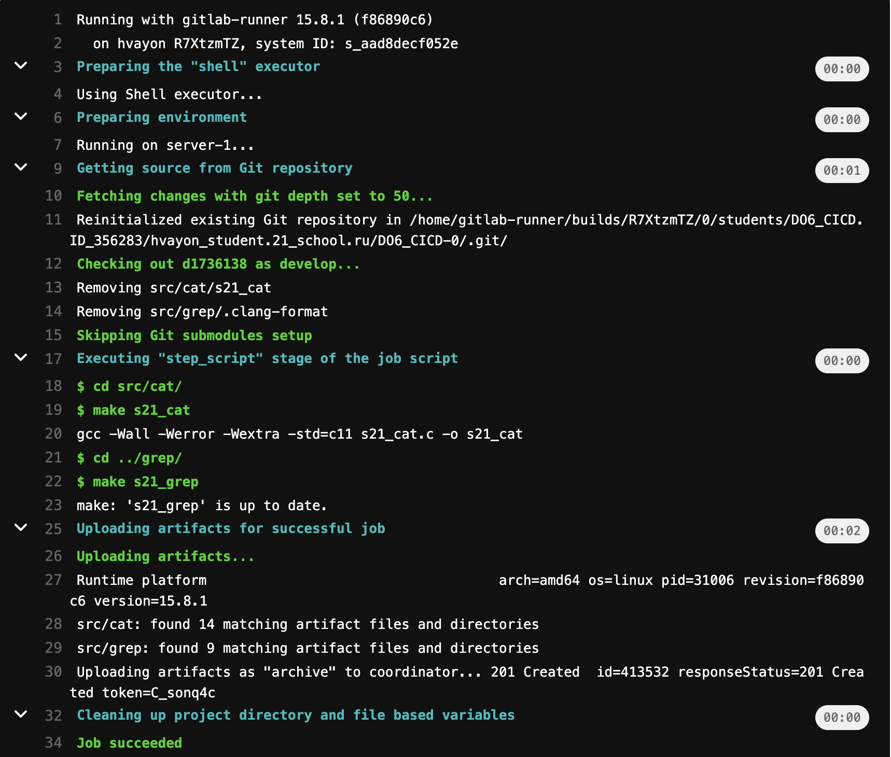

## Part 3. Тест кодстайла

**Написать этап для CI, который запускает скрипт кодстайла (*clang-format*)**

* В файле *gitlab-ci.yml* добавляем этап проверки codestyle, если он не отработает корректно, но пайплайн будет зафейлен
* В пайплайне отображаем вывод утилиты *clang-format*

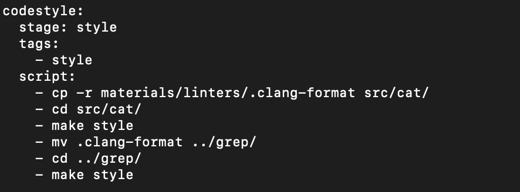

* Результат сборки:

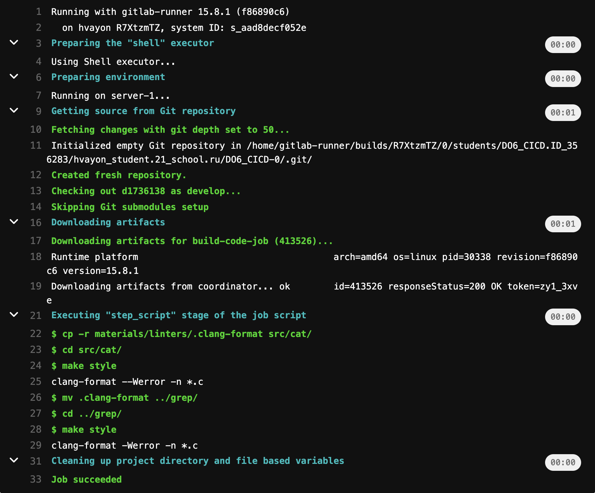

## Part 4. Интеграционные тесты

**Написать этап для CI, который запускает ваши интеграционные тесты из того же проекта:**

* Запускаем этот этап автоматически только при условии, что сборка и тест codestyle прошли успешно

* Если тесты не прошли, то пайплайн будет зайфейлен

* В пайплайне отобразить вывод, что интеграционные тесты успешно прошли / провалились

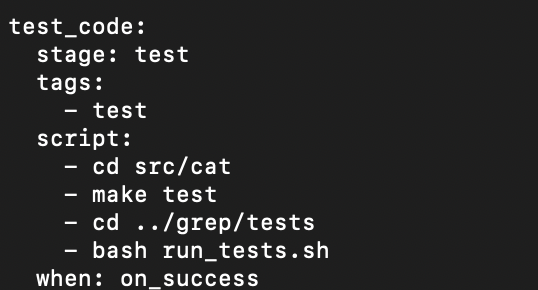

Результат сборки:

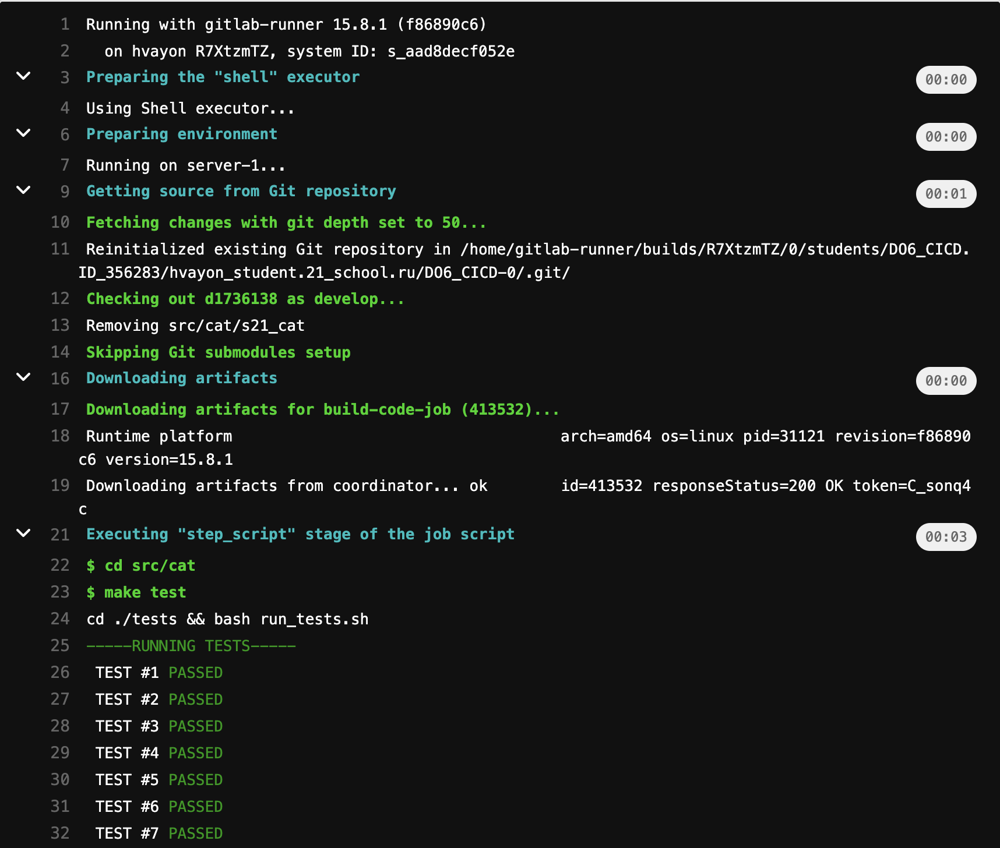

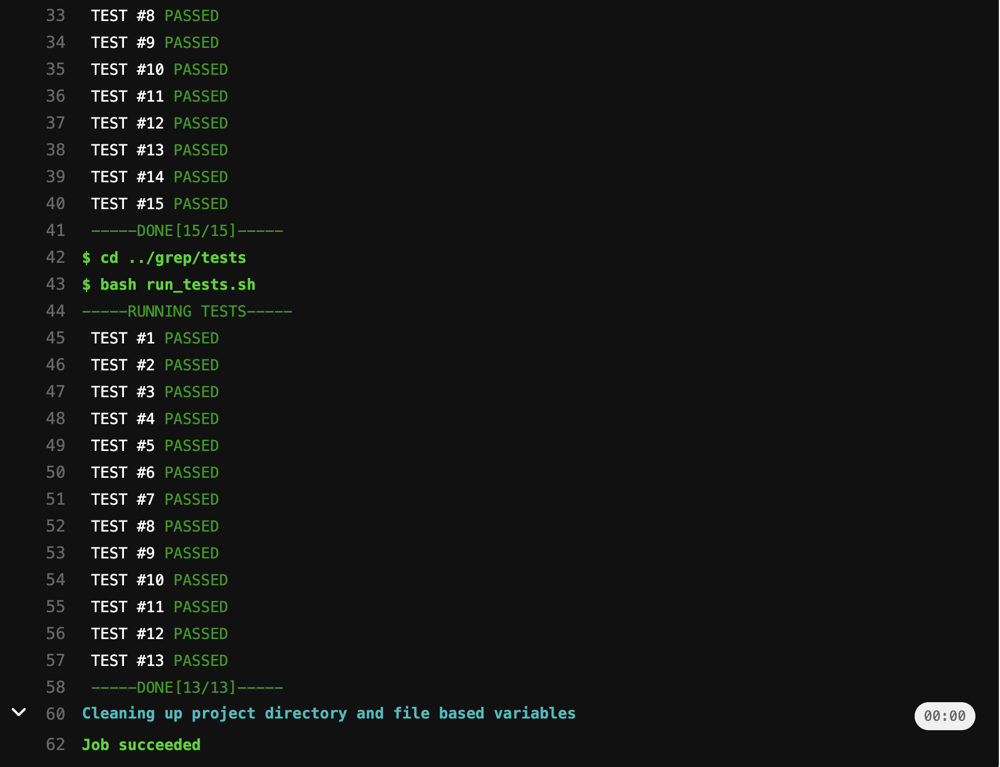

## Part 5. Этап деплоя

* Поднять вторую виртуальную машину *Ubuntu Server 20.04 LTS*

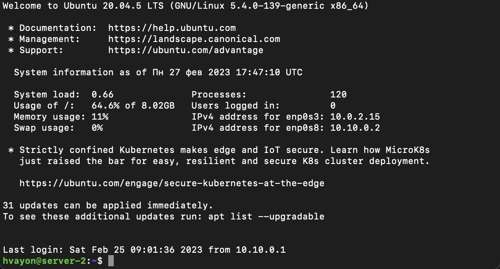

* Пробрасываем маршрут от машине к машине с помощью конфигурационных файлов *netplan.yml*
	* Первая машина
	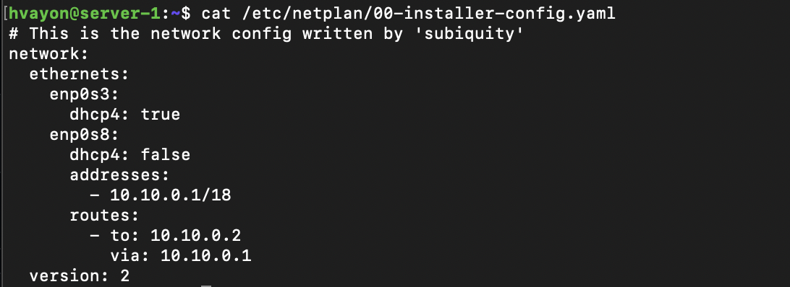
	* Вторая машина
	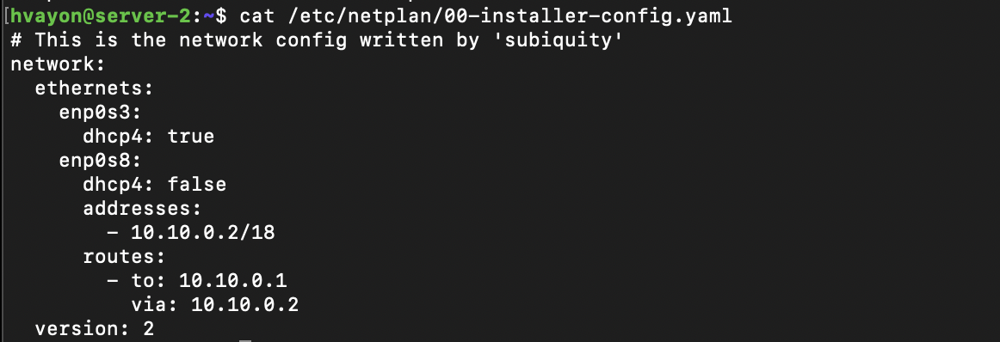
enp0s8 - виртуальный адаптер хоста

* Пишем скрипт  который при помощи ssh и scp копирует файлы, полученные после сборки (артефакты), в директорию /usr/local/bin второй виртуальной машины

* Используем утилиту **expect**, которая позволяет создавать программы, ожидающие вопросов от других программ и дающие им ответы. Скрипт копирует артифакты из одной машины в другую.

* Дописываем в файл *.gitlab-ci.yml* этап дейплоя

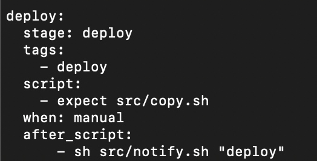

* Этот этап запускается вручную при условии, что все предыдущие этапы прошли успешно

* Результат работы:

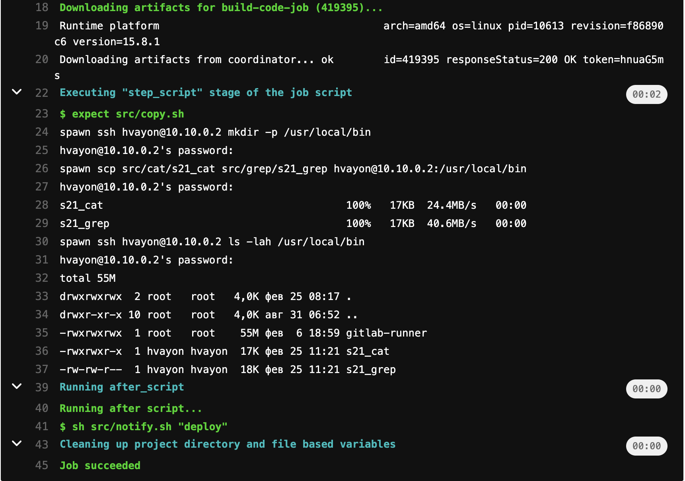

## Part 6. Дополнительно. Уведомления

* Создаем telegram-бота с помощью @BotFather

* Получаем токен бота и используем его в нашем скрипте из materials/notification.md

* Добавляем идентификатор профиля telegram и job_status ($CI_JOB_STATUS) в скрипт

* После каждой джобы прописываем запуск скрипта *notify.sh* в файле *.gitlab-ci.yml*

* Скрипт присылает уведомления об успешном/неуспешном выполнении пайплайна через бота с именем "hvayon DO6 CI/CD" в Telegram

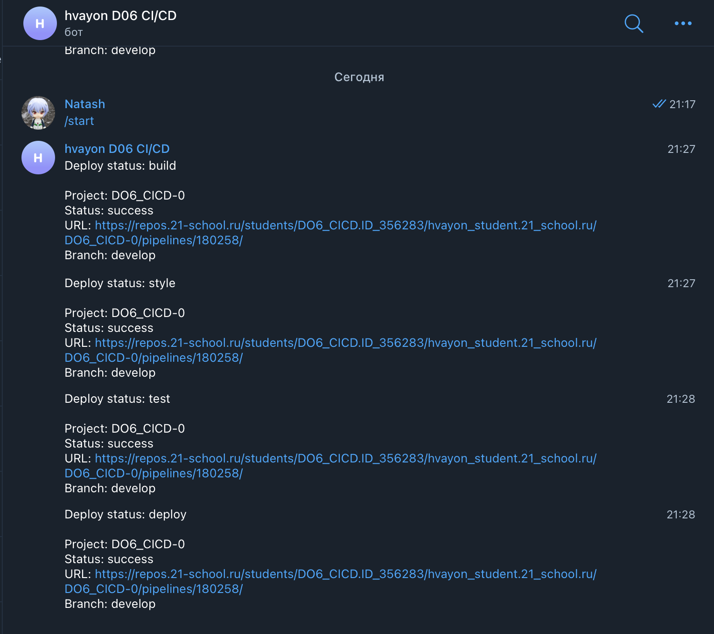